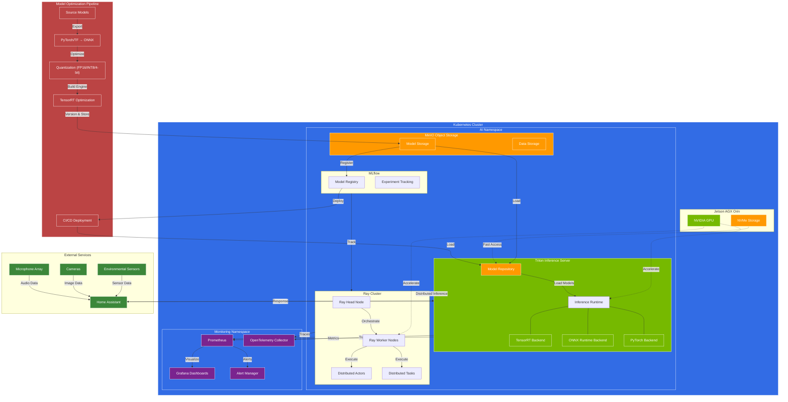

# AI Inference Architecture for Homelab

This document provides a comprehensive overview of the AI inference architecture implemented in the homelab environment, focusing on NVIDIA Triton Inference Server and Ray running on a Jetson AGX Orin device, orchestrated by Kubernetes.

## System Architecture Diagram



## Architecture Components

### Hardware Infrastructure

- **Jetson AGX Orin**: The core compute platform providing GPU acceleration for AI workloads
  - **GPU**: NVIDIA Ampere architecture with 2048 CUDA cores and 64 Tensor cores
  - **NVMe Storage**: High-speed local storage for models and temporary data

### Kubernetes Orchestration

Kubernetes provides container orchestration for all components, ensuring:
- Resource allocation and scheduling
- High availability and fault tolerance
- Service discovery and load balancing
- Scaling and auto-healing capabilities

### NVIDIA Triton Inference Server

Triton Inference Server provides optimized model serving capabilities:

- **Model Repository**: Structured storage for versioned models with configuration
- **Inference Runtime**: Core engine handling inference requests
- **Multiple Backends**:
  - TensorRT for maximum NVIDIA GPU performance
  - ONNX Runtime for cross-platform compatibility
  - PyTorch/TensorFlow for native framework support

### Ray Cluster

Ray provides distributed computing capabilities:

- **Head Node**: Coordinates tasks and manages the cluster
- **Worker Nodes**: Execute distributed tasks and actors
- **Resource Management**: Dynamic allocation of CPU, GPU, and memory
- **Task Scheduling**: Priority-based task distribution and workload management

### Model Optimization Pipeline

Converts and optimizes models for maximum performance on Jetson hardware:

1. **Source Model Export**: Export from training frameworks
2. **ONNX Conversion**: Standard interchange format
3. **Quantization**: Reduce precision to FP16, INT8, or 4-bit for efficiency
4. **TensorRT Optimization**: Create optimized engine plans
5. **CI/CD Deployment**: Automated testing and deployment

### Storage Systems

- **MinIO Object Storage**: S3-compatible storage for models and data
- **MLflow Model Registry**: Version tracking and metadata management
- **Local NVMe Storage**: High-speed cache for active models

### Monitoring & Observability

- **Prometheus**: Metrics collection and storage
- **Grafana**: Interactive visualization dashboards
- **Alert Manager**: Notification and alerting system
- **OpenTelemetry**: Distributed tracing for request flows

### External Integrations

- **Home Assistant**: Smart home platform consuming inference services
- **Microphones**: Audio input for voice commands and sound recognition
- **Cameras**: Visual input for object detection, recognition, and tracking
- **Environmental Sensors**: Data sources for predictive models

## Data Flow

1. **Model Preparation Flow**:
   - Models are converted, optimized, and quantized for Jetson AGX Orin
   - Optimized models are stored in MinIO and registered in MLflow
   - CI/CD pipeline deploys models to Triton Inference Server

2. **Inference Request Flow**:
   - Home Assistant sends inference requests to Triton
   - Triton routes requests to appropriate backend
   - GPU accelerates inference computation
   - Results returned to Home Assistant for action

3. **Distributed Processing Flow**:
   - Complex workloads distributed via Ray
   - Ray manages resources and schedules tasks
   - Workers process tasks in parallel
   - Results aggregated and returned

## Performance Considerations

- **Dynamic Batching**: Combines multiple requests for efficient processing
- **Instance Groups**: Controls parallelism for multi-model execution
- **Concurrency Limits**: Prevents resource exhaustion
- **Memory Management**: Optimizes for Jetson AGX Orin's unified memory architecture
- **Quantization**: Reduces memory footprint and increases throughput
- **Model Caching**: Keeps frequently used models ready for inference

This architecture provides a balance of performance, flexibility, and integration capabilities for AI inference in a homelab environment, leveraging the computational power of the Jetson AGX Orin while providing enterprise-grade orchestration through Kubernetes.

## C4 Model View (Alternative)

For a more structured architectural view, here's the C4 model representation:

```plantuml
@startuml
!include https://raw.githubusercontent.com/plantuml-stdlib/C4-PlantUML/master/C4_Container.puml

LAYOUT_WITH_LEGEND()

title AI Inference Architecture - Container View

Person(homeUser, "Home User", "A person using the smart home system")

System_Boundary(homeLab, "Homelab AI Infrastructure") {
    Container(homeAssistant, "Home Assistant", "Python/Home Assistant Core", "Smart home automation hub, processes user inputs and sensors")

    Container(tritonServer, "Triton Inference Server", "C++/NVIDIA Triton", "High-performance model serving system")

    Container(rayCluster, "Ray Cluster", "Python/Ray", "Distributed computing framework")

    Container(mlFlow, "MLflow", "Python/MLflow", "Model registry and experiment tracking")

    Container(minIO, "MinIO", "Object Storage", "S3-compatible model and data storage")

    Container(k8s, "Kubernetes", "Container Orchestration", "Manages containers, scaling, and networking")

    Container(modelOptPipeline, "Model Optimization Pipeline", "Python/ONNX/TensorRT", "Converts and optimizes models")

    Container(monitoring, "Monitoring Stack", "Prometheus/Grafana", "Observability and metrics")
}

System_Ext(sourceModels, "Model Sources", "Pre-trained models from research or custom training")
System_Ext(sensors, "IoT Sensors & Devices", "Cameras, microphones, environmental sensors")

Rel(homeUser, homeAssistant, "Interacts with", "Voice/UI/API")
Rel(homeUser, sensors, "Interacts with")

Rel(homeAssistant, tritonServer, "Requests inference", "REST/gRPC")
Rel(tritonServer, homeAssistant, "Returns predictions", "JSON/Protocol Buffers")

Rel(homeAssistant, sensors, "Reads data from")
Rel(sensors, homeAssistant, "Sends data to", "MQTT/API")

Rel(sourceModels, modelOptPipeline, "Source models")
Rel(modelOptPipeline, minIO, "Stores optimized models")
Rel(modelOptPipeline, mlFlow, "Registers models")

Rel(mlFlow, tritonServer, "Deploys models to")
Rel(minIO, tritonServer, "Provides model artifacts")

Rel(tritonServer, rayCluster, "Distributes computation")
Rel(rayCluster, tritonServer, "Returns results")

Rel(k8s, tritonServer, "Orchestrates")
Rel(k8s, rayCluster, "Orchestrates")
Rel(k8s, mlFlow, "Orchestrates")
Rel(k8s, minIO, "Orchestrates")
Rel(k8s, monitoring, "Orchestrates")

Rel(tritonServer, monitoring, "Reports metrics")
Rel(rayCluster, monitoring, "Reports metrics")
Rel(k8s, monitoring, "Reports metrics")

@enduml
```

This architecture diagram provides a comprehensive view of how different components interact to deliver AI inference capabilities in your homelab environment.
