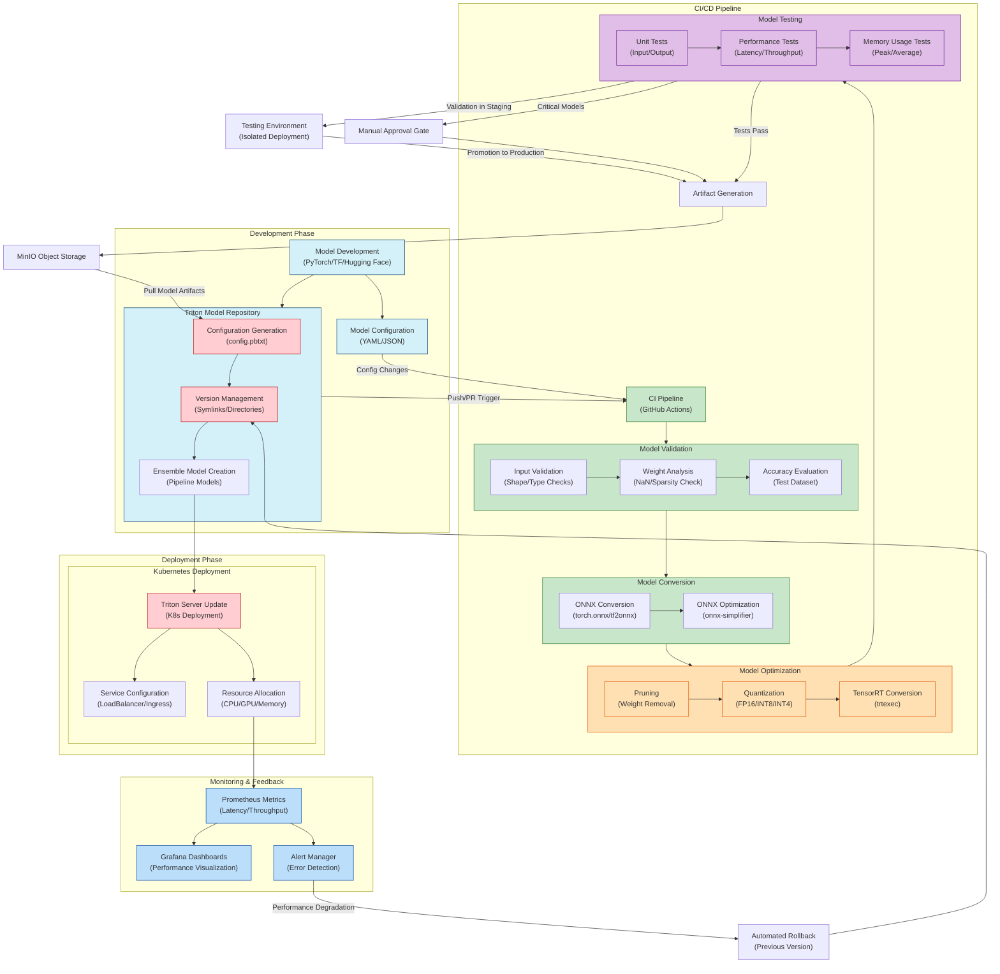

# AI Model Deployment Pipeline

This diagram illustrates the complete model deployment pipeline for AI models in a homelab environment, from development through validation, optimization, testing, and production deployment.

## CI/CD Workflow Diagram

## Model Deployment Pipeline Components

### 1. Development Phase
- **Model Development**: Create or fine-tune models using frameworks like PyTorch, TensorFlow, or Hugging Face
- **Source Repository**: Version-controlled storage of model code and training scripts
- **Model Configuration**: Define parameters, metadata, and deployment requirements

### 2. CI/CD Pipeline

#### Validation Stage
- **Input Validation**: Verify model input shapes, types, and requirements
- **Weight Analysis**: Check for numerical issues, incorrect initialization, or over-parameterization
- **Accuracy Evaluation**: Measure model performance against test datasets

#### Conversion Stage
- **ONNX Conversion**: Convert framework-specific models to framework-agnostic ONNX format
- **ONNX Optimization**: Apply graph optimizations, constant folding, and shape inference

#### Optimization Stage
- **Pruning**: Remove unnecessary weights or connections to reduce model size
- **Quantization**: Reduce precision (FP32→FP16→INT8→INT4) to improve inference performance
- **TensorRT Conversion**: Generate optimized TensorRT engines for NVIDIA hardware acceleration

#### Testing Stage
- **Unit Tests**: Verify functional correctness with known inputs/outputs
- **Performance Tests**: Measure latency, throughput at various batch sizes and concurrency levels
- **Memory Tests**: Monitor peak and average memory usage during inference

### 3. Artifact Generation and Storage
- Package optimized models, configuration files, and metadata
- Store in MinIO object storage with version tracking

### 4. Deployment Phase

#### Triton Model Repository Configuration
- **Configuration Generation**: Create Triton-specific configuration files
- **Version Management**: Handle multiple model versions with symlinks and directories
- **Ensemble Models**: Create model pipelines (e.g., preprocessing → inference → postprocessing)

#### Kubernetes Deployment
- **Triton Server Update**: Rolling updates of Triton deployment
- **Service Configuration**: Expose models through appropriate services/ingress
- **Resource Allocation**: Assign CPU/GPU/memory resources based on model requirements

### 5. Monitoring and Feedback
- **Prometheus Metrics**: Collect latency, throughput, error rates
- **Grafana Dashboards**: Visualize model performance and system resource usage
- **Alert Manager**: Detect and notify on performance degradation or errors

## Key Integration Points

1. **GitOps Workflow**: Git pushes/PRs trigger CI/CD pipeline
2. **MinIO Integration**: Central storage for model artifacts with versioning
3. **Kubernetes Integration**: Deployment, scaling, and resource management
4. **Monitoring Integration**: Performance metrics feed back to development process

## Deployment Strategies

1. **Blue-Green Deployment**: Maintain two identical environments; switch traffic when new version is validated
2. **Canary Deployment**: Gradually route traffic to new model version
3. **A/B Testing**: Direct specific user segments to different model versions
4. **Automated Rollback**: Quickly revert to previous version if performance degrades
