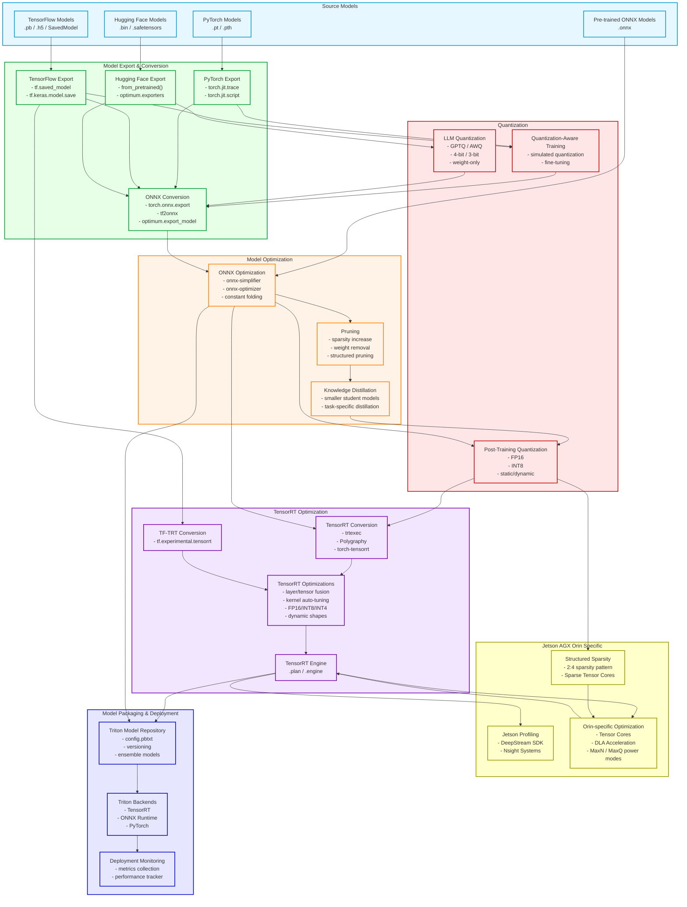

# Model Optimization Pipeline for Homelab AI 🏡🤖

This document outlines the model optimization pipeline designed for efficient AI inference in a homelab environment, specifically optimized for the NVIDIA Jetson AGX Orin hardware. 🚀

## Pipeline Overview 🗺️

The following diagram illustrates the complete model optimization workflow from source models to deployment:

## Pipeline Stages ⚙️

### 1. Source Models 📥

Starting points for the optimization pipeline:

- **PyTorch Models** - Native PyTorch models in `.pt` or `.pth` format 🔥
- **TensorFlow Models** - TensorFlow models in `.pb`, `.h5`, or SavedModel format 🐍
- **Hugging Face Models** - Models from Hugging Face Hub in various formats 🤗
- **Pre-trained ONNX Models** - Models already in ONNX format 📦

### 2. Model Export & Conversion 📤

Converting models to standard formats:

- **PyTorch Export** 🚀
  - Using `torch.jit.trace` for models with static shapes 📏
  - Using `torch.jit.script` for models with control flow 🕹️

- **TensorFlow Export** 📦
  - Using `tf.saved_model.save` for complete model serialization 💾
  - Using `tf.keras.models.save_model` for Keras models 📚

- **Hugging Face Export** 🫂
  - Using `from_pretrained()` to load models ⬇️
  - Using `optimum.exporters` for optimized exports ✨

- **ONNX Conversion** 🔄
  - Using `torch.onnx.export` for PyTorch 🔥
  - Using `tf2onnx` for TensorFlow 🐍
  - Using `optimum.export_model` for Hugging Face models 🤗

### 3. Model Optimization ⚡

Improving model size and performance:

- **ONNX Optimization** ⚙️
  - Using `onnx-simplifier` to remove redundant operations ✂️
  - Using `onnx-optimizer` for various graph optimizations 📈
  - Applying constant folding to pre-compute constant expressions 🧮

- **Pruning** 🌳
  - Increasing model sparsity (removing less important weights) 🗑️
  - Structured pruning for hardware compatibility 🧩
  - Channel pruning for convolutional layers 🔪

- **Knowledge Distillation** 🎓
  - Creating smaller student models that learn from larger models 👶
  - Task-specific distillation for improved efficiency 🎯

### 4. Quantization 🔢

Reducing precision for better performance:

- **Post-Training Quantization** 📉
  - FP16 quantization (half precision) 🌗
  - INT8 quantization with calibration 🌡️
  - Static vs. dynamic quantization options ⚖️

- **Quantization-Aware Training** 🧠
  - Training with simulated quantization 模拟
  - Fine-tuning for accuracy recovery 🔧

- **LLM Quantization** 🗣️
  - GPTQ / AWQ / SmoothQuant for large language models 🐳
  - 4-bit / 3-bit precision for extreme compression 🔬
  - Weight-only quantization 🏋️

### 5. TensorRT Optimization 🏎️

Optimizing for NVIDIA hardware:

- **TensorRT Conversion** 🔄
  - Using `trtexec` command-line tool ⌨️
  - Using Polygraphy for ONNX-to-TensorRT conversion 🧪
  - Using `torch-tensorrt` for PyTorch models 🔥

- **TF-TRT Conversion** 🐍
  - Using `tf.experimental.tensorrt` interface 💻

- **TensorRT Optimizations** ✨
  - Layer and tensor fusion 🔗
  - Kernel auto-tuning ⚙️
  - FP16/INT8/INT4 optimization 🔢
  - Dynamic shapes support 🤸

- **TensorRT Engine**  엔진
  - Serialized engine plan (`.plan` or `.engine`) 🚦

### 6. Jetson AGX Orin Specific Optimization 🚀

Hardware-specific optimization:

- **Jetson Profiling** 📊
  - DeepStream SDK for multi-stream inference 🌊
  - Nsight Systems for performance analysis 🔍

- **Orin-specific Optimization** 🎯
  - Leveraging Ampere architecture Tensor Cores 💡
  - Deep Learning Accelerator (DLA) integration 🧠
  - MaxN / MaxQ power modes for performance/efficiency trade-offs ⚡

- **Structured Sparsity** 🧱
  - 2:4 sparsity pattern for Ampere acceleration 🔢
  - Leveraging sparse Tensor Cores 💡

### 7. Model Packaging & Deployment 📦

Deploying optimized models:

- **Triton Model Repository** 🏛️
  - Creating proper `config.pbtxt` with optimized settings ⚙️
  - Model versioning for A/B testing 🧪
  - Ensemble models for complex pipelines 🧩

- **Triton Backends** 🧰
  - TensorRT backend for optimized NVIDIA acceleration 🏎️
  - ONNX Runtime backend for cross-platform compatibility 🌐
  - PyTorch backend for quick deployment 🔥

- **Deployment Monitoring** 监控
  - Metrics collection (latency, throughput, memory) 📈
  - Continuous performance tracking 🔭

## Key Optimization Considerations for Jetson AGX Orin 🔑

1. **Tensor Core Utilization** 💡
   - Ensure operations are compatible with Tensor Cores by using appropriate data layouts and shapes 📐
   - Use FP16 precision where possible to leverage Tensor Core acceleration ⚡

2. **Memory Bandwidth Optimization** 🧠
   - Use quantization to reduce model size and memory bandwidth requirements 📉
   - Optimize data movement between system memory and GPU memory 🚚

3. **Power Efficiency** 🔋
   - Profile different power modes (MaxN, MaxQ) for optimal performance/watt ⚡
   - Use dynamic batch sizes based on current workload ⚙️

4. **Benchmarking** 🏁
   - Use tools like `trtexec` for isolated performance benchmarking 🧪
   - Compare performance across different optimization techniques 📊

5. **Error Handling** 🐛
   - Implement proper error handling for quantization artifacts 🩹
   - Validate model accuracy at each optimization step ✅

By following this pipeline, models can be significantly optimized for deployment on Jetson AGX Orin hardware, achieving lower latency, higher throughput, and better energy efficiency while maintaining acceptable accuracy. 🎉
