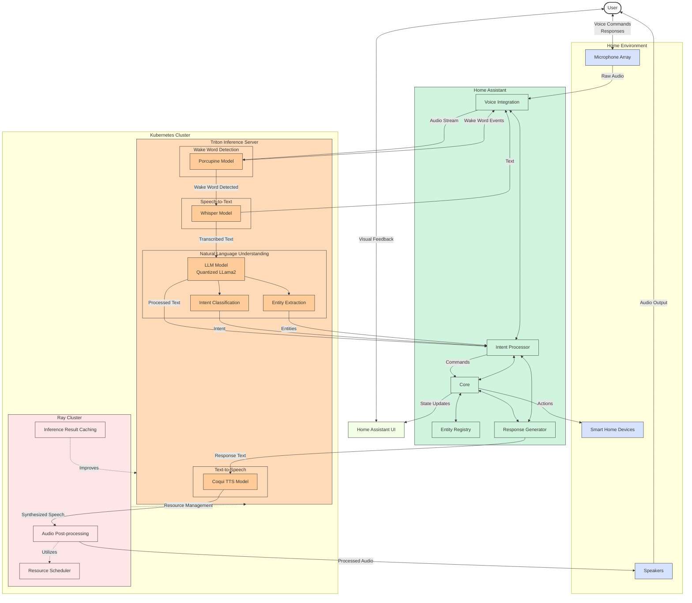
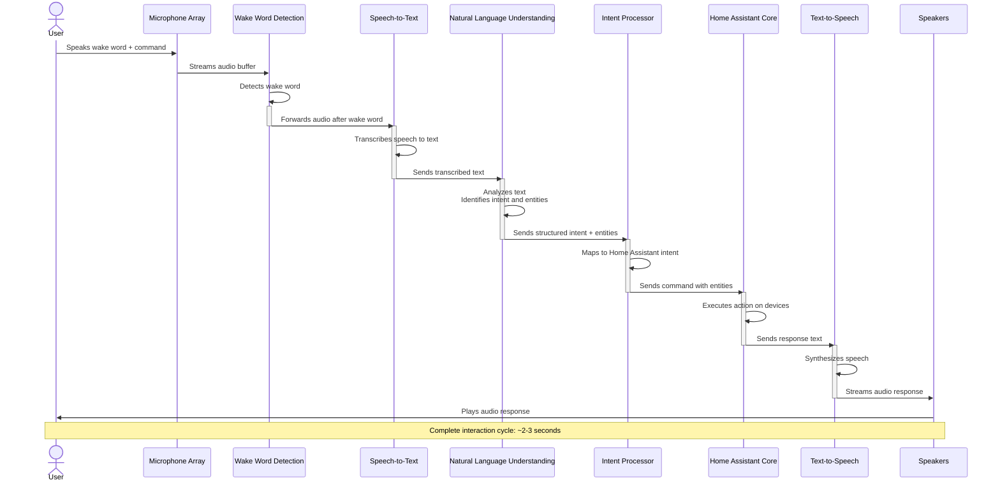

# Voice Assistant Pipeline

This diagram shows the voice assistant pipeline that integrates Home Assistant with Triton Inference Server, including all major components and data flows.

## System Architecture Overview

## Sequence Diagram for Voice Assistant Interaction

## Component Detail View

```mermaid
flowchart LR
    %% Wake Word Detection Detail
    subgraph WakeWord["Wake Word Detection (Porcupine)"]
        AudioBuffer[Audio Buffer<br/>Sliding Window]
        FeatureExtraction[MFCC<br/>Feature Extraction]
        PorcupineEngine[Porcupine Engine<br/>Keyword Spotting]
        ThresholdDetection[Confidence<br/>Thresholding]

        AudioBuffer --> FeatureExtraction
        FeatureExtraction --> PorcupineEngine
        PorcupineEngine --> ThresholdDetection
    end

    %% STT Detail
    subgraph SpeechToText["Speech-to-Text (Whisper)"]
        AudioSegmenter[Audio Segmenter]
        SpectrogramConv[Spectrogram<br/>Conversion]
        WhisperEncoder[Whisper Encoder]
        WhisperDecoder[Whisper Decoder]

        AudioSegmenter --> SpectrogramConv
        SpectrogramConv --> WhisperEncoder
        WhisperEncoder --> WhisperDecoder
    end

    %% NLU Detail
    subgraph NLU["Natural Language Understanding"]
        TokenizerLLM[Tokenization]
        LLMInference[LLM Inference<br/>Context-Aware]
        IntentExtract[Intent Parser]
        EntityRecognizer[Entity<br/>Recognition]

        TokenizerLLM --> LLMInference
        LLMInference --> IntentExtract
        LLMInference --> EntityRecognizer
    end

    %% Home Assistant Intent Processing
    subgraph IntentProc["Intent Processing"]
        IntentMapper[Intent Schema<br/>Mapping]
        EntityResolver[Entity<br/>Resolution]
        ValidationLogic[Validation Logic]
        ContextBuilder[Context<br/>Building]

        IntentMapper --> EntityResolver
        EntityResolver --> ValidationLogic
        ValidationLogic --> ContextBuilder
    end

    %% TTS Detail
    subgraph TextToSpeech["Text-to-Speech (Coqui)"]
        TextNormalizer[Text Normalizer]
        Vocoder[Neural Vocoder]
        AudioPostproc[Audio<br/>Post-processing]

        TextNormalizer --> Vocoder
        Vocoder --> AudioPostproc
    end

    %% Connections between major components
    WakeWord -->|"Wake Detection Event"| SpeechToText
    SpeechToText -->|"Text Transcript"| NLU
    NLU -->|"Structured Intent"| IntentProc
    IntentProc -->|"HA Service Call"| HAExecution[Home Assistant<br/>Action Execution]
    HAExecution -->|"Response Text"| TextToSpeech

    %% Styling
    classDef blue fill:#d7e3fc,stroke:#333,stroke-width:1px
    classDef green fill:#d0f4de,stroke:#333,stroke-width:1px
    classDef orange fill:#ffdab9,stroke:#333,stroke-width:1px
    classDef red fill:#ffe6e6,stroke:#333,stroke-width:1px

    class WakeWord,AudioBuffer,FeatureExtraction,PorcupineEngine,ThresholdDetection blue
    class SpeechToText,AudioSegmenter,SpectrogramConv,WhisperEncoder,WhisperDecoder green
    class NLU,TokenizerLLM,LLMInference,IntentExtract,EntityRecognizer orange
    class IntentProc,IntentMapper,EntityResolver,ValidationLogic,ContextBuilder,HAExecution red
    class TextToSpeech,TextNormalizer,Vocoder,AudioPostproc blue
```

## Performance and Optimization Considerations

- **End-to-end Latency**: The pipeline is optimized to keep total latency under 2 seconds from wake word detection to response
- **Model Quantization**: All models are quantized (INT8/FP16) for Jetson AGX Orin's hardware accelerators
- **Batch Processing**: Audio is processed in overlapping chunks for continuous recognition
- **Caching**: Common intents and responses are cached to reduce inference time
- **Resource Management**: Ray manages GPU memory allocation between different inference tasks
- **Offline Operation**: The entire pipeline operates locally without cloud dependencies

## Integration Points

- **Home Assistant**: Via custom component and WebSocket API
- **Triton Inference Server**: gRPC API for efficient inference
- **Ray Cluster**: For distributed resource management and task scheduling
- **Audio Hardware**: Via ALSA/PulseAudio interfaces
- **Smart Home Devices**: Through Home Assistant integrations
